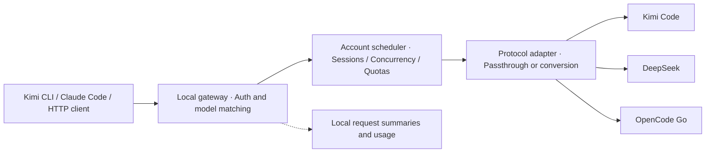

<p align="center">
  
</p>

<h1 align="center">Navo</h1>

Navo was previously named Kimi Code Helper. It now uses its own Navo application identity and data directory; legacy configuration is not loaded automatically.

<p align="center">One desktop app to manage Kimi Code, DeepSeek, and OpenCode Go accounts, requests, and usage.</p>

<p align="center"><a href="README.md">简体中文</a> · <strong>English</strong></p>

<p align="center">
  <a href="https://github.com/DuskLin/navo/releases">Downloads</a> ·
  <a href="#quick-start">Quick start</a> ·
  <a href="#connect-your-client">Client setup</a> ·
  <a href="#remote-quota-dashboard">Remote dashboard</a> ·
  <a href="docs/reference.zh-CN.md">Technical reference (Chinese)</a>
</p>


> Desktop screenshots show the real Electron UI running against local smoke-test fixtures. Accounts, quotas, costs, and requests are simulated; the port shown is assigned dynamically for testing. The application UI is currently in Chinese; this project provides Chinese and English READMEs.

## Features

Navo combines provider accounts into a local pool and gives coding assistants a single HTTP gateway on `127.0.0.1`. Loopback clients do not need a key; LAN clients use a gateway key. The app selects an available account, forwards requests, and records usage.

| Feature                     | What it does                                                                                                                     |
| --------------------------- | -------------------------------------------------------------------------------------------------------------------------------- |
| Multiple providers          | Add, edit, enable, and disable accounts; sync models, quotas, or balances                                                        |
| Account scheduling          | Keep sessions on the same account when available; score new sessions by concurrency and remaining quota, with failover           |
| Three client protocols      | OpenAI Responses, Chat Completions, and Anthropic Messages, with passthrough or conversion based on model protocol settings      |
| Usage and performance       | Token trends, cache hit rates, activity heatmaps, time to first token, generation speed, and peak/off-peak performance           |
| Cost estimates              | Prefer upstream-reported costs; otherwise estimate from model prices, with price configuration and subscription quota valuation  |
| Live gateway topology       | Harness → session → model nodes, directional upload/download connections, and model token usage                                  |
| Session retention           | Aggregate calls per session, stable node ordering, and a 5/10/15/30/60-minute idle-retention slider                              |
| Client and model logos      | Recognize supported Harness clients and display model-family brand icons                                                         |
| LAN sharing                 | Optional LAN listening, address copying, and gateway-key rotation                                                                |
| Remote quota dashboard      | View live quotas, balances, and usage in phone, iPad, and desktop browsers, with orientation-aware layouts and account details   |
| Built-in Cloudflare Tunnel  | Manage temporary public links or a fixed domain inside the app; no separate connector installation                               |
| Read-only access protection | Independent access codes, HTTPS, session revocation, and login rate limits; inference APIs and account secrets are not exposed   |
| Model registry              | Kimi Code import with known context limits, reasoning efforts, and input/output capabilities                                     |
| Background operation        | Keep the gateway running in the tray after closing the window; animate the tray icon during requests                             |
| Desktop controls            | Light and dark themes, card visibility settings, and reorderable account cards                                                   |
| Local storage               | Encrypt configuration with system secure storage; persist request summaries in SQLite without storing prompts or response bodies |

## Supported providers

| Provider    | Account type                           | Synced information                                            |
| ----------- | -------------------------------------- | ------------------------------------------------------------- |
| Kimi Code   | China / international API key or local OAuth | Models, 5-hour / 7-day quotas, concurrency limit              |
| DeepSeek    | Platform API key, pay as you go        | Models and balances per currency, without currency conversion |
| OpenCode Go | API key with an active Go subscription | Models and 5-hour / weekly / monthly quota windows            |

The app uses fixed upstream addresses and fetches model lists from each provider. OpenCode Zen pay-as-you-go accounts are outside the current scope. Protocol availability depends on the provider and model; checking a protocol in the app does not add upstream support for it.

## Quick start

### Install or run from source

Check [Releases](https://github.com/DuskLin/navo/releases) for available versions and assets. Packaging targets include macOS (DMG / ZIP), Windows (NSIS EXE), and Linux (AppImage). macOS uses ad hoc signing; developer certificate signing and notarization are not configured. Windows code signing is not configured either.

To run from source, install **Node.js 22.12.0 or later** and npm:

```bash
git clone https://github.com/DuskLin/navo.git
cd navo
npm ci
npm run dev
```

### Add an account and start the gateway

1. Open **账号管理** (Account management), add an account in the account pool, select a provider, and enter its API key.
2. Wait for models, quotas, or balances to sync successfully. Enable the account and adjust concurrency or model protocols if needed.
3. Start the gateway. It listens on `127.0.0.1:17300` by default. Stop it before changing the port if that port is occupied.
4. Copy the address and **gateway key** from the account pool, or use **Kimi 配置** (Kimi config) / **Claude 配置** (Claude config).
5. Configure a client using the examples below, then inspect the overview and request history after sending a request.

## Connect your client

These examples use the default port. Replace `<GATEWAY_KEY>` with the gateway key copied from the app. The model ID must appear in an enabled account's model list. Enter provider API keys in the app.

### Kimi Code CLI

Use **Kimi 配置** to copy the configuration. Merge it into `~/.kimi/config.toml`, keeping your other settings. Place `default_model` at the top level of the file:

```toml
default_model = "navo"

[providers.navo]
type = "kimi"
base_url = "http://127.0.0.1:17300/v1"
api_key = "<GATEWAY_KEY>"

[models.navo]
provider = "navo"
model = "kimi-for-coding"
max_context_size = 262144
```

You can also select the model with `kimi --model navo`. When switching models, update the model ID and its context settings accordingly.

### Claude Code / Anthropic clients

Set these environment variables in the terminal where you launch the client (macOS / Linux / Git Bash):

```bash
export ANTHROPIC_BASE_URL='http://127.0.0.1:17300'
export ANTHROPIC_AUTH_TOKEN='<GATEWAY_KEY>'
export ANTHROPIC_MODEL='kimi-for-coding'
claude
```

The Anthropic Base URL must omit the trailing `/v1`; the client appends the endpoint path. In Windows PowerShell, use the same variable names with syntax such as `$env:ANTHROPIC_BASE_URL='http://127.0.0.1:17300'`.

### HTTP / OpenAI-compatible clients

Set the Base URL to `http://127.0.0.1:17300/v1` and the API key to your gateway key. List models first, then send a streaming request:

```bash
curl http://127.0.0.1:17300/v1/models \
  -H 'Authorization: Bearer <GATEWAY_KEY>'

curl http://127.0.0.1:17300/v1/chat/completions \
  -H 'Authorization: Bearer <GATEWAY_KEY>' \
  -H 'Content-Type: application/json' \
  -H 'X-Session-Id: my-session' \
  -d '{"model":"kimi-for-coding","messages":[{"role":"user","content":"Hello"}],"stream":true}'
```

| Method | Endpoint                    | Purpose                                           |
| ------ | --------------------------- | ------------------------------------------------- |
| GET    | `/v1/models`                | Aggregate models from enabled, synced accounts    |
| POST   | `/v1/chat/completions`      | OpenAI Chat Completions                           |
| POST   | `/v1/responses`             | OpenAI Responses                                  |
| POST   | `/v1/messages`              | Anthropic Messages                                |
| POST   | `/v1/messages/count_tokens` | Token counting; locally estimated for OpenCode Go |

Authentication accepts `Authorization: Bearer …` or `x-api-key`. OpenCode Go's local token estimates include the response header `x-token-count-estimated: true`.

## Remote quota dashboard

Open **设置 → 远程仪表盘** (Settings → Remote dashboard) in the desktop app and enable the dashboard. The web page refreshes every 30 seconds and when brought back to the foreground, with manual refresh, light/dark themes, and connection/stale-data indicators. Keep the desktop app running; it can remain in the tray with its main window closed.

1. **LAN access:** enable LAN access and open the displayed HTTPS address (default port `61948`). Before trusting the self-signed certificate, compare its SHA-256 fingerprint with the value under certificate/access management.
2. **Public access:** select a temporary link or a fixed domain, then save and apply. The connector is bundled with the app. A fixed domain requires your Cloudflare domain and a dedicated Tunnel Token; see the [configuration guide](docs/mobile-dashboard.md) (Chinese).
3. **Sign in:** copy the access code from the desktop app, open the address in a phone or iPad browser, and enter the code. Share the URL and code separately. Sessions last up to eight hours; rotating the access code immediately revokes existing sessions.

Temporary links change whenever the connector restarts. **An online connector does not guarantee that the public URL is ready.** DNS/edge propagation, proxies, and cached results can cause a delay. Wait for the public reachability check to pass. Failed checks retry every 15 seconds, or you can retry manually; repeatedly restarting the connector creates more new URLs.

The dashboard has its own read-only server and access code, separate from the inference gateway and its keys. It does not expose API keys, group keys, request bodies, or management APIs. Access codes and Tunnel credentials are encrypted with system secure storage. See the [dashboard guide](docs/mobile-dashboard.md) for security boundaries, fixed-domain configuration, and troubleshooting.

## Screenshots

The app adds a menu bar / system tray icon on launch. Closing the main window hides it while the gateway keeps running in the background. Choose “显示主窗口” (Show main window) from the icon menu, or launch the app again, to restore it. Choose “退出 Navo” (Quit Navo) to stop the gateway and exit; macOS also supports ⌘Q.

### Phone dashboard

Portrait mode uses a single column and bottom navigation. Open an account to inspect its quota windows, reset times, and usage trend. Landscape mode switches to two columns and top navigation. Account names come directly from your settings.

<p align="center">
  
  
</p>

### iPad dashboard

Portrait mode displays two columns; landscape mode expands to three. Cards in each row have equal heights, and account details use a split layout.

<p align="center">
  
</p>


> These are actual web UI screenshots captured at 2× resolution with emulated phone/iPad viewports and fixed demo data. They contain no real accounts, access codes, or public URLs. They are not photos of physical devices or a native iOS app. In normal use, the dashboard displays live data synchronized by the desktop app.

### Live gateway dashboard

Switch between **额度** (Quotas) and **调度** (Live flow) in the title bar. This looping SVG was converted from an actual screen recording:


This animation was recorded before the rename; Kimi Code Helper in the recording is now Navo.

- **Live topology:** real gateway requests form Harness → session → model branches. Main-agent, subagent, and concurrent calls sharing a session use one node; this is not a count of internal agents. Model IDs and input/output token usage update with requests.
- **Directional connections:** cyan flows right for uploads; purple flows left for responses. Animation reflects recent transfer events while node backgrounds stay static. Token counts use reported usage; missing values show “—”.
- **Idle retention:** after all requests finish, the Bot turns gray with an offline icon. Choose 5, 10, 15, 30, or 60 minutes using the toolbar slider; releasing it saves automatically. New calls reactivate the node; expired nodes disappear.
- **Stable, responsive layout:** first-seen node ordering survives old-request cleanup. Nodes scale within size limits, with vertical scrolling for large graphs. The dashboard fills the content area and supports light and dark themes.
- **Client identification:** includes Zcode, Kimi Code (CLI, desktop, VS Code), Claude Code, Codex, Qoder, WorkBuddy, Pi, DeepSeek Harness, and Cline, with Harness and model-family logos. Explicit attribution takes priority over UA matching. Generic UAs may need a [dedicated client URL](docs/harness-identification.md).

The dashboard prefers explicit session IDs, falling back to available gateway session/cache identifiers. Requests without an identifier remain separate. The recording above is user-provided; the static screenshots below use smoke-test fixtures.

### Dark overview

Check account availability, quota windows, model performance, and token activity in one place.


### Account configuration

Select a provider and region, enter an API key, and sync upstream information. Use automatic or manual concurrency limits and configure supported upstream protocols per model.


### Request history

Inspect the account, request ID, model, reasoning effort, status, first-token latency, total latency, and cost for each request.


## How it works



Sessions stay on an available account to preserve cache benefits. The scheduler reassigns a session when its account is at capacity, out of quota, unavailable due to authentication failure, or cooling down. Connection failures and selected HTTP errors can trigger retries; **requests are never retried after the response has started**. Provide a stable session identifier using `X-Session-Id` or `prompt_cache_key`; bindings are isolated by model.

## Limits and data storage

- The gateway listens only on `127.0.0.1` for local clients. WebSocket is unsupported. The request body limit is 8 MB, the default total timeout is 300 seconds, and requests return 503 when no account is available.
- Cross-protocol requests require full message history. Upstream-private references such as `previous_response_id` and `file_id`, upstream-hosted search, background tasks, and `n > 1` are unsupported during conversion and produce explicit errors.
- Cost estimates use current model prices and treat missing prices and usage as zero. Updating prices changes historical estimates; currencies remain separate. Cost estimates and quota valuations are not actual bills. Interrupted usage includes only usage reported before interruption.
- Configuration is encrypted using system secure storage in `gateway.json` under Electron's user data directory. Linux refuses to save credentials without an available keyring. Encrypted configuration depends on the original system keychain and is not portable between machines.
- Request summaries persist in `gateway.json.requests.sqlite` in the same directory without automatic cleanup. Theme preferences live in `settings.json`. The default macOS directory is `~/Library/Application Support/Navo/`.
- On macOS, closing the window keeps the gateway running; quitting the app stops it. On other platforms, closing the last window quits the app. Session bindings, cooldowns, and runtime scheduling state reset on exit; configuration and request summaries persist.

## Development and verification

Built with **Electron · React · TypeScript · electron-vite**.

| Command                | Purpose                                                                     |
| ---------------------- | --------------------------------------------------------------------------- |
| `npm run dev`          | Watch the main process, preload scripts, and renderer                       |
| `npm run typecheck`    | Check TypeScript types                                                      |
| `npm run build`        | Type-check and build into `out/`                                            |
| `npm start`            | Run the built application                                                   |
| `npm run test:unit`    | Test the gateway, protocol conversion, scheduling, usage, and related logic |
| `npm run test:smoke`   | Build and run real Electron smoke tests                                     |
| `npm test`             | Run unit and smoke tests                                                    |
| `npm run pack`         | Create an unpacked application for the current platform                     |
| `npm run dist`         | Generate installers in `dist/` for the current platform                     |
| `npm run format:check` | Check formatting; use `npm run format` to format files                      |

Smoke tests require a graphical environment and system secure storage. They use temporary configuration and local mock upstreams, consume no real account quota, and write screenshots to `artifacts/`. They do not constitute end-to-end validation with real providers. Development restarts interrupt active requests; for stable operation, build first and use `npm start`.

```text
src/
  main/                 # Electron lifecycle, IPC, and local services
    services/           # Gateway, scheduling, conversion, storage, pricing
  preload/              # Restricted APIs exposed to the renderer
  renderer/src/         # Accounts, dashboard, charts, and themes
  shared/               # Types, protocols, quotas, usage, and cost calculations
tests/                  # Unit tests
scripts/                # Development launcher and Electron smoke tests
docs/                   # Technical reference, protocol audit, README images
.github/workflows/      # Cross-platform builds and releases
```

## Packaging and releases

Normally, run `npm run dist` on the target operating system. The repository's [release workflow](.github/workflows/release.yml) runs when you push a version tag starting with `v` or publish a GitHub Release. It builds macOS x64 (Intel) and arm64 (Apple Silicon) DMG / ZIP installers, Windows x64 NSIS EXE, and Linux x64 AppImage. You can also run the workflow manually from Actions with an existing tag, without moving that tag.

```bash
git tag v0.1.0
git push origin v0.1.0
```

Choose a new, unpublished version number. Pushing a tag creates a draft Release if needed and uploads assets. Publishing an existing Release preserves its title and handwritten notes while refreshing generated notes and assets. Release assets are uploaded only after all platform builds and installation checks succeed; Actions artifacts are retained for 14 days.

Run `npm run test:update:mac` on macOS with compiler tools to verify checksum rejection, staging, replacement, relaunch and backup using an isolated test app. This does not replace your installed application.

Each release receives Chinese notes grouped into new features, fixes, and other improvements. Reruns refresh the generated section while preserving handwritten content. See [release note conventions](release-notes/README.md) for Chinese commit descriptions, `Release-Note-zh` trailers, and reviewed version summaries.

### In-app updates

Installed builds check GitHub stable releases 10 seconds after launch and every six hours afterward. Use the bottom-right update button to check manually. New versions download in the background; click **Restart and install** when ready. Restarting interrupts active gateway requests but preserves accounts and settings. Development builds do not check for updates, and prereleases are excluded.

The app bundle, bundle ID and update ZIP now use the Navo identity. Versions using the old bundle name require one manual installation of `Navo.app`; their updater cannot recognize the new names. The registry provider ID and copied configuration examples now use `navo`. Existing clients can continue using the gateway URL; select the new provider when importing again.

macOS downloads the ZIP for the running architecture, verifies its SHA-512 checksum, bundle ID and version, then replaces the app after exit without requiring an Apple Developer certificate. Install the app in a writable directory first, rather than running from a DMG. Replacement or launch-command failures restore the old app; a backup remains beside the installation in `.navo-update-*/previous.app`. Remove that backup directory after verifying the new version. Windows uses NSIS; Linux requires a writable AppImage.

CI publishes installers, blockmaps and update manifests, merging both Mac architectures into `latest-mac.yml`. Prefer publishing the draft after all assets have uploaded. Keep ZIP files and update manifests attached. Install the first version containing this feature manually; subsequent higher versions can update in-app. The source is public GitHub Releases; no GitHub token is embedded in the client.

### Windows / Linux release validation

Pull requests build all platforms without publishing. Releases include macOS x64/arm64 DMG and ZIP, Windows x64 NSIS EXE, and Linux x64 AppImage. Windows CI silently installs the final EXE and launches the installed application. Linux CI launches the final AppImage through FUSE on Ubuntu 22.04 with Xvfb, D-Bus and an unlocked GNOME Keyring. `npm run test:installed` checks the window/preload, real credential encryption, persistence across restart, HTTP gateway forwarding, SQLite history, dashboard assets and the bundled cloudflared executable. Only upstream transport uses a local fixture. Failures block release uploads; diagnostics are retained in `installation-check-*` artifacts.

Linux requires FUSE 2, executable permission on the AppImage and an unlocked Secret Service/KWallet desktop keyring. Minimal environments without a keyring cannot save accounts. Kimi Code desktop quota integration remains macOS-only. These checks do not cover every Linux distribution, real provider credentials, public Tunnel connectivity, Windows signing reputation prompts, or the complete Windows/Linux update-installation flow. Treat platform support as unverified until the new native CI jobs pass.

## Further reading

- [Protocol conversion implementation](docs/protocol-conversion.zh-CN.md): request mapping, tool history, streaming state machine, usage, and error handling (Chinese).
- [Technical reference](docs/reference.zh-CN.md): synchronization, scheduling scores, metric definitions, configuration migration, and storage details (Chinese).
- [Screenshot sources](docs/images/README.md): image provenance and update instructions.

## License

[MIT](LICENSE)

### Import a local Kimi login

Sign in to Kimi Code, then open Settings → Account management → Add account and select “Kimi Code · 本地登录态” in the provider dropdown. Choose the account region and import. Re-importing updates the same account while preserving its name, groups, enabled state and manual models.

Navo reads `credentials/kimi-code.json` and `device_id` from `~/.kimi` or `~/.kimi-code`, or only from `KIMI_SHARE_DIR` when set. Legacy macOS `kimi-code` Keychain credentials are supported. Credentials are encrypted and refreshed automatically; they are never returned to the UI. Shared refresh tokens may be rotated by either app. If authentication expires, sign in again and re-import. Navo does not modify Kimi Code files.
