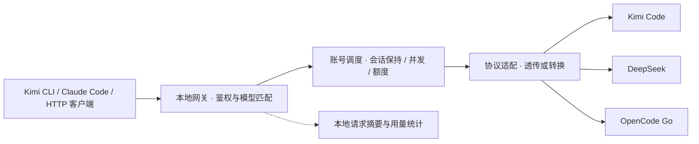

<p align="center">
  
</p>

<h1 align="center">Navo</h1>

Navo 原名 Kimi Code Helper，目前使用独立的 Navo 应用身份与数据目录，不会自动读取旧版配置。

<p align="center">一个桌面应用，统一管理 Kimi Code、DeepSeek 与 OpenCode Go 账号、请求和用量。</p>

<p align="center"><strong>简体中文</strong> · <a href="README.en.md">English</a></p>

<p align="center">
  <a href="https://github.com/DuskLin/navo/releases">下载安装包</a> ·
  <a href="#快速开始">快速开始</a> ·
  <a href="#客户端接入">客户端接入</a> ·
  <a href="#远程额度仪表盘">远程仪表盘</a> ·
  <a href="docs/reference.zh-CN.md">技术参考</a>
</p>


> 桌面截图来自真实 Electron 界面的本地冒烟测试，账号、额度、费用和请求均为模拟数据，截图端口为测试动态端口。当前应用界面为中文；本项目提供中英文 README。

## 能做什么

Navo 将多个供应商账号汇入本地账号池，通过 `127.0.0.1` 上的 HTTP 网关为编程助手提供统一入口。本机回环连接无需密钥，局域网客户端使用网关密钥，应用负责选择可用账号、转发请求和记录用量。

| 功能                   | 说明                                                                                    |
| ---------------------- | --------------------------------------------------------------------------------------- |
| 多供应商账号池         | 添加、编辑、启停账号，同步模型、额度或余额                                              |
| 智能调度               | 优先保持会话绑定；新会话按并发与剩余额度评分，故障时切换账号                            |
| 三种客户端协议         | 支持 OpenAI Responses、Chat Completions 和 Anthropic Messages，按模型协议配置透传或转换 |
| 用量与性能             | Token 趋势、缓存命中率、消耗热力图、首 token 耗时、生成速度及峰谷表现                   |
| 费用参考               | 上游报告费用优先，否则按模型单价估算；支持价格配置和订阅额度估值                        |
| 实时调度看板           | Harness → 会话 → 模型拓扑，连接线区分上传与下传，展示模型 Token 用量                    |
| 会话节点管理           | 同一会话聚合请求，固定节点顺序；空闲保留 5／10／15／30／60 分钟可调                     |
| 客户端与模型标识       | 支持多种 Harness 识别及品牌 Logo，模型按家族展示图标                                    |
| 局域网共享             | 可选 LAN 监听、地址复制与网关密钥轮换，本机回环连接免密                                 |
| 远程额度仪表盘         | 手机、iPad 与桌面浏览器查看真实额度、余额及用量；支持横竖屏、账号筛选和额度详情         |
| 内置 Cloudflare Tunnel | App 内启停公网访问，支持临时链接和固定域名，无需单独安装连接器                          |
| 只读访问保护           | 独立访问码、HTTPS、会话撤销和登录限速；公网只开放仪表盘，不暴露模型接口或账号密钥       |
| 模型注册表             | Kimi Code 一键导入，导出已知上下文、思考强度及输入输出能力                              |
| 后台运行               | 关闭窗口后托盘驻留，活动请求以状态栏光带提示                                            |
| 桌面体验               | 浅色／深色主题、卡片显示设置、可调整账号卡片顺序                                        |
| 本地存储               | 系统安全存储加密配置；SQLite 保存请求摘要，不保存提示词或回复正文                       |

## 支持的供应商

| 供应商      | 账号类型                   | 同步信息                             |
| ----------- | -------------------------- | ------------------------------------ |
| Kimi Code   | 中国区／国际区 API Key     | 模型、5 小时／7 天额度、并发上限     |
| DeepSeek    | 开放平台 API Key，按量付费 | 模型、各币种余额（分别显示，不换算） |
| OpenCode Go | 已订阅 Go 的 API Key       | 模型、5 小时／周／月额度窗口         |
| Codex       | 本地 ChatGPT OAuth 登录    | 可用模型、剩余额度及重置时间、认证自动刷新 |

上游地址由应用固定，模型列表由上游同步。OpenCode Zen 按量付费账号不在当前接入范围。协议最终可用性取决于供应商和模型；在界面中勾选协议不会让上游新增能力。

## 快速开始

### 安装或从源码启动

在 [Releases](https://github.com/DuskLin/navo/releases) 查看可用版本与附件。打包配置支持 macOS（DMG / ZIP）、Windows（NSIS EXE）和 Linux（AppImage）；macOS 使用 ad hoc 签名，尚未配置开发者证书签名和公证，Windows 尚未配置代码签名。

从源码运行需要 **Node.js 22.12.0 或更高版本**及 npm：

```bash
git clone https://github.com/DuskLin/navo.git
cd navo
npm ci
npm run dev
```

### 添加账号并启动网关

1. 打开「账号管理」，在账号池中添加账号，选择供应商并填写该平台的 API Key。
2. 等待模型、额度或余额同步成功，确认账号启用；按需设置并发上限和模型协议。
3. 启动网关，默认监听 `127.0.0.1:17300`；端口被占用时，在停止网关后修改端口。需要供同一局域网的设备使用时，停止网关，在「网关设置」中开启「局域网共享」，保存并重新启动；账号管理页会在本机地址下方显示局域网地址及其复制入口。
4. 从账号池复制地址；本机连接无需密钥，局域网客户端还需复制**网关密钥**。密钥在网关启停和应用重启后保持不变；需要更新时，在局域网连接栏点击「轮换密钥」并确认，再复制新密钥更新局域网客户端。旧密钥不能再发起局域网请求，已在处理的请求不受影响。
5. 按下方示例配置客户端，发送请求后在概览和请求记录中查看结果。

## 客户端接入

### 手动补充模型

所有供应商账号均支持在「编辑账号 → 可用模型 → 手动添加模型」中填写模型 ID（例如 `gpt-6-astra`）。点击「添加模型」，确认上游协议后保存账号，即可通过网关调用。Codex 固定使用 Responses，其他入口由网关转换。

手动模型会标注「手动」，并在同步上游、重启和重新导入 Codex 认证后保留；删除仅对当前账号生效，也可通过「恢复已删除模型」恢复。手动添加不代表上游已验证该模型可用，实际调用仍取决于账号权限。

### 导入本地 Codex 认证

先在本机 Codex 使用 ChatGPT 账号登录，再打开「设置 → 实验性功能」，点击「导入本地 Codex 认证」。导入后启动网关，使用账号中同步到的模型 ID 调用网关即可。

- 默认目录在 macOS 优先读取 `Codex Auth` 钥匙串，再回退到 `~/.codex/auth.json`；设置 `CODEX_HOME` 时使用该目录，自定义目录不读取默认钥匙串。Windows / Linux 当前支持文件认证。
- 同一用户、同一工作区重复导入会更新认证，保留账号名称、开关及并发设置。凭据仅在主进程读取，并通过系统安全存储加密保存，不会复制到剪贴板或返回界面。
- 上游使用 Codex Responses 接口；网关支持 Responses、Chat Completions 和 Messages 的流式及非流式调用。上游固定 `store=false`，需要传入完整对话历史，不支持 `previous_response_id` 或后台任务。
- 认证临近过期时先采纳本机同账号的新令牌，再尝试刷新网关保存的认证。不会修改原 Codex 登录文件或钥匙串；若本机与网关轮换了同一刷新令牌而导致认证失效，请重新登录并导入。

认证存储方式可参阅 [OpenAI Codex 认证文档](https://developers.openai.com/codex/auth)。读取方式参考 cc-switch，转发和刷新流程参考 sub2api。

### Kimi Code 注册表导入

启动网关后，在账号管理页点击「复制 api.json 链接」。在 Kimi Code 的「添加供应商 → 注册表」中，将链接粘贴到「注册表 URL」，本机连接的「API Key」可留空（客户端必填时填写任意占位值）；局域网连接点击「密钥」复制网关密钥并填入「API Key」，点击导入。

`GET http://127.0.0.1:<端口>/api.json` 无需鉴权；通过局域网地址访问时使用网关密钥鉴权（`Authorization: Bearer <网关密钥>`），返回 Kimi Code 支持的注册表格式。模型列表随已启用且同步成功的账号更新，并自动去重；同一 URL 重复导入可刷新。链接和返回内容均不包含密钥，使用期间需保持本地网关运行。

注册表从 Models.dev 同步模型展示名、上下文窗口、最大输出长度、思考能力、思考强度档位及图片／视频等输入输出能力，复用 24 小时目录缓存及「费用管理」中保存的模型匹配；多个供应商提供同一模型时采用已知限制中的最小值。未匹配的模型保留原始 ID 用于请求，展示名做可读化处理，未知窗口不编造数值（客户端可能采用自己的默认值）。

注册表能力字段包括 `reasoning`、`support_efforts`、`tool_call` 和 `modalities`。思考档位由 Models.dev 的 `reasoning_options` 转换；默认档位仅在目录明确提供且属于可用档位时导出。同名模型跨账号调度时仅声明共同支持的能力。未提供的字段保持未知，不根据模型名称推测。

以下示例使用默认端口。请替换 `<GATEWAY_KEY>` 为应用中复制的网关密钥，模型 ID 必须存在于已启用账号的可用模型列表中。上游 API Key 填在应用中。

### Kimi Code CLI

点击「Kimi 配置」可复制配置。将下面内容合并到 `~/.kimi/config.toml`，保留其他设置；`default_model` 应位于文件顶层：

```toml
default_model = "navo"

[providers.navo]
type = "kimi"
base_url = "http://127.0.0.1:17300/v1"
api_key = "<GATEWAY_KEY>"

[models.navo]
provider = "navo"
model = "kimi-for-coding"
max_context_size = 262144
```

也可以通过 `kimi --model navo` 选择模型。切换模型时，请同步调整模型 ID 和相应上下文配置。

### Claude Code / Anthropic 客户端

在启动客户端的同一个终端中设置环境变量（macOS / Linux / Git Bash）：

```bash
export ANTHROPIC_BASE_URL='http://127.0.0.1:17300'
export ANTHROPIC_AUTH_TOKEN='<GATEWAY_KEY>'
export ANTHROPIC_MODEL='kimi-for-coding'
claude
```

Anthropic Base URL 不带末尾 `/v1`，客户端会自行追加接口路径。Windows PowerShell 使用 `$env:ANTHROPIC_BASE_URL='http://127.0.0.1:17300'` 等同名环境变量写法。

### 通用 HTTP / OpenAI 兼容客户端

OpenAI 兼容客户端的 Base URL 为 `http://127.0.0.1:17300/v1`，本机 API Key 可留空或填写任意占位值，局域网 API Key 为网关密钥。可先查询模型，再发送流式请求：

```bash
curl http://127.0.0.1:17300/v1/models \
  -H 'Authorization: Bearer <GATEWAY_KEY>'

curl http://127.0.0.1:17300/v1/chat/completions \
  -H 'Authorization: Bearer <GATEWAY_KEY>' \
  -H 'Content-Type: application/json' \
  -H 'X-Session-Id: my-session' \
  -d '{"model":"kimi-for-coding","messages":[{"role":"user","content":"你好"}],"stream":true}'
```

| 方法 | 端点                        | 用途                                 |
| ---- | --------------------------- | ------------------------------------ |
| GET  | `/v1/models`                | 汇总已启用、已同步账号的模型         |
| POST | `/v1/chat/completions`      | OpenAI Chat Completions              |
| POST | `/v1/responses`             | OpenAI Responses                     |
| POST | `/v1/messages`              | Anthropic Messages                   |
| POST | `/v1/messages/count_tokens` | Token 计数；OpenCode Go 使用本地估算 |

鉴权支持 `Authorization: Bearer …` 或 `x-api-key`。OpenCode Go 的本地 Token 估算带有 `x-token-count-estimated: true` 响应头。

## 远程额度仪表盘

在桌面 App 打开 **设置 → 远程仪表盘**，开启「启用仪表盘」。网页每 30 秒读取最新数据，支持手动刷新、前台恢复刷新、深浅色切换，以及连接中断／额度数据过期提示。桌面 App 需要保持运行，关闭主窗口后可继续在托盘中运行。

1. **局域网访问**：开启「允许局域网访问」，使用页面给出的 HTTPS 地址，默认端口为 `61948`。首次访问自签名证书时，先核对「证书与访问管理」中的 SHA-256 指纹。
2. **公网访问**：选择「临时链接」或「固定域名」，保存并应用。连接器随 App 内置，无需额外安装；固定域名需配置你在 Cloudflare 的域名与专用 Tunnel Token，具体见[配置说明](docs/mobile-dashboard.md)。
3. **登录**：点击「复制访问码」，在手机或 iPad 浏览器中打开地址并输入访问码。地址与访问码分开传递；会话最长 8 小时，重置访问码会立即退出所有已登录设备。

临时链接每次重启连接器都会变化。**「连接器在线」不等于公网地址已可访问**：新域名的 DNS／边缘转发可能需要等待，代理和缓存也可能影响结果。等待显示「公网已验证」后再使用；检测失败每 15 秒自动重试，也可手动「重新检测」，无需反复重启生成新链接。

仪表盘使用独立只读服务和访问码，与模型网关及其密钥隔离。API Key、分组密钥、请求正文和管理接口不会通过仪表盘公开；访问码与 Tunnel 凭证使用系统安全存储加密。完整边界、固定域名配置及排错说明见[远程仪表盘文档](docs/mobile-dashboard.md)。

## Zcode 会话迁移（实验性）

在「设置 → 实验性功能 → Zcode → Kimi Code Desktop 会话迁移」中扫描本机会话，勾选后导入。默认读取 `~/.zcode`，合并 `cli/db/db.sqlite` 与 `v2/sessions`，写入 `~/.kimi-code`；扫描后可修改目录。迁移前结束源会话并退出 Kimi Code Desktop，完成后重新打开 Desktop。

- 支持旧版 `meta + messages` JSON 和新版 CLI SQLite 的 session/message/part；按 tasks-index 校验任务来源覆盖。选择旧 `v2/sessions` 目录也会自动发现同一数据根下的 CLI 数据库。输出 Kimi 会话 v2 / wire 1.5。
- 数据库以只读事务读取，保留 message/part 顺序与完整数据库记录快照，恢复当前撤回分支、独立子会话及 artifact 图片。空会话自动忽略，索引存在但找不到原记录的任务明确提示。
- 按源 `parts` 顺序生成 Kimi 原生思考、文本、工具调用和结果事件，保留错误/中断状态及轮次边界；内嵌图片与视频复制到会话媒体目录。依据 `parentToolUseId` 恢复可关联的子代理工具记录和汇总结果。
- 每个会话附带 `migration-report.json`，报告工具/思考/附件/子代理数量和缺失信息。Zcode 已截断的输出、未保存的子代理中间对话无法凭空恢复；未知格式或损坏附件会拒绝导入，不静默丢弃。
- 不迁移运行中的任务、授权、文件回滚记录或模型配置；迁移后的新对话使用 Kimi 当前配置。
- 旧版纯文本导入会提示「旧版导入可重新迁移」，新版生成独立会话并保留旧会话及其后续对话。
- 每个导入会话保存完整的 `zcode-source.json` 原始副本；源文件保持不变。重复导入同一源快照会跳过；源会话新增内容后导入新的完整快照，不覆盖已有会话，包括在 Kimi 中继续后的内容。
- 扫描后源文件变化会拒绝导入，需要重新扫描。单个文件失败不影响其他会话，失败原因显示在页面中。
- 中断后可重新勾选「已导入」会话，补全索引登记。如果意外退出遗留 `~/.kimi-code/.navo-zcode-migration.lock`，确认没有迁移运行后删除该锁文件再重试。

此集成依赖客户端本地文件格式；Kimi 或 Zcode 更改格式后可能需要更新适配。

兼容性验证：`npm run test:migration:kimi` 使用本机 Kimi 二进制在临时数据目录中验证原生 transcript、图片读取、子代理及继续对话（本地模拟模型，无真实 API 调用）。可用 `KIMI_CODE_BIN` 指定二进制，`NAVO_ZCODE_AUDIT_SOURCE` 指定只读源目录进行全部会话回放检查。

## 界面预览

应用启动后会显示状态栏／系统托盘图标。关闭主窗口会隐藏窗口，网关继续在后台运行；点击图标菜单中的「显示主窗口」可恢复界面，再次启动应用也会恢复已有窗口。需要完全退出并停止网关时，选择「退出 Navo」（macOS 也可使用 ⌘Q）。

状态栏图标空闲时为白色；网关正在处理请求时，蓝色光带沿 Logo 顺时针流转，悬停可查看当前请求数。所有请求结束后自动恢复白色。

### 手机端仪表盘

手机竖屏使用单列额度卡片和底部导航；点击账号查看 5 小时／周／月额度、重置时间及用量趋势。横屏自动切换为双列卡片与顶部导航，账号名称直接使用用户配置。

<p align="center">
  
  
</p>

### iPad 端仪表盘

iPad 竖屏采用双列卡片，横屏展开为三列；同排卡片等高，额度数值保持突出，详情页左右分栏。

<p align="center">
  
</p>


> 以上截图来自实际网页的手机／iPad 视口模拟，以 2 倍分辨率捕获，使用固定示例数据，不含真实账号、访问码或公网地址；不是实体设备拍摄或原生 iOS App。正常使用时网页展示桌面 App 同步的真实数据。

### 实时调度看板

点击右上角「额度／调度」切换视图。下面是实际操作录屏转换的循环动画 SVG：


此动图录制于改名前，画面中的 Kimi Code Helper 即 Navo。

- **实时拓扑**：按 Harness → 会话 → 模型展示真实网关请求。同一会话的主 Agent、子 Agent 与并发调用汇总到同一节点，模型名称及输入／输出 Token 随请求更新；不代表客户端内部独立 Agent 数量。
- **双向连线**：青色向右表示上传，紫色向左表示响应下传；最近有实际收发事件时连线流动，节点背景保持静态。Token 以实际 usage 上报为准，未上报显示「—」。
- **空闲保留**：请求全部结束后，Bot 置灰并显示离线图标；顶栏滑块可选 5、10、15、30、60 分钟，松开自动保存。新请求恢复活动，保留期结束后移除。
- **稳定、自适应布局**：节点按首次出现顺序排列，清理旧请求不会交换节点位置；随窗口大小缩放并限制尺寸，节点过多时纵向滚动。看板铺满内容区，支持深浅色主题。
- **客户端识别**：覆盖 Zcode、Kimi Code（CLI／桌面／VS Code）、Claude Code、Codex、Qoder、WorkBuddy、Pi、DeepSeek Harness、Cline 等客户端，并展示 Harness 与模型品牌 Logo。优先使用明确的客户端归属信息，否则匹配 UA；通用 UA 无法可靠识别时可使用[专属接入地址](docs/harness-identification.md)。

看板优先按明确的会话 ID 归组，缺失时使用网关可用的会话／缓存标识；完全没有标识时按独立请求展示，不强行合并。该录屏是用户提供的实际界面，以下静态截图来自模拟数据的冒烟测试。

### 深色概览

在同一屏查看账号可调度状态、额度窗口、模型表现和 Token 活动。


### 账号配置

选择供应商与区域，填写 API Key 后同步上游信息。并发上限可自动获取或手动设置，模型支持的上游协议可单独配置。


### 请求记录

按请求查看账号、Request ID、模型、思考强度、状态、首字耗时、总耗时和费用，便于定位失败和比较性能。


## 工作原理



同一会话优先复用可用账号以保留缓存优势；账号满载、额度耗尽、认证失败或冷却时重新分配。连接失败及部分 HTTP 错误可触发重试，**已开始返回响应后不再重试**。使用 `X-Session-Id` 或 `prompt_cache_key` 提供稳定的会话标识，绑定按模型隔离。

## 使用边界与数据存储

- 网关默认仅监听 `127.0.0.1`；开启局域网共享后监听所有 IPv4 网卡，并显示本机的私有 IPv4 地址（优先 `192.168.*`）。局域网客户端仍需网关密钥，系统防火墙需允许连接所选端口。不支持 WebSocket。请求体上限 8 MB，默认总超时 300 秒，无可用账号时返回 503。
- 跨协议请求需携带完整消息历史；不支持跨上游私有引用（如 `previous_response_id`、`file_id`）、上游托管搜索、后台任务及 `n > 1`，这些情况会明确报错。
- 费用估算按当前单价计算，缺失价格与用量按 0 计，价格更新后历史估算会变化；不同币种分别显示。费用和额度估值不能视为实际账单，中断消耗仅包含中断前已报告的用量。
- 配置存放于 Electron 用户数据目录的 `gateway.json`，通过系统安全存储加密；Linux 无可用密钥环时拒绝保存凭据。加密配置依赖原系统钥匙串，不适合直接复制到其他机器。
- 请求摘要保存在同目录的 `gateway.json.requests.sqlite`，不自动清理；主题保存在 `settings.json`。macOS 默认目录为 `~/Library/Application Support/Navo/`。
- macOS 关闭窗口后网关继续运行，退出应用才停止；其他平台关闭最后一个窗口会退出。会话绑定、冷却及运行时调度状态在退出后清空，配置和请求摘要保留。

## 开发与验证

技术栈：**Electron · React · TypeScript · electron-vite**。

| 命令                      | 用途                                                     |
| ------------------------- | -------------------------------------------------------- |
| `npm run dev`             | 开发模式，监听主进程、预加载和界面变更                   |
| `npm run typecheck`       | TypeScript 检查                                          |
| `npm run build`           | 检查类型并构建到 `out/`                                  |
| `npm start`               | 运行已构建的应用                                         |
| `npm run test:unit`       | 网关、协议转换、调度、用量等单元测试                     |
| `npm run test:smoke`      | 构建并运行真实 Electron 冒烟测试                         |
| `npm run test:update:mac` | macOS 隔离应用：下载校验、替换、重启与备份（需编译工具） |
| `npm test`                | 单元测试和冒烟测试                                       |
| `npm run pack`            | 生成当前平台应用目录                                     |
| `npm run dist`            | 生成当前平台安装包到 `dist/`                             |
| `npm run format:check`    | 检查格式（`npm run format` 可自动格式化）                |

冒烟测试需要图形环境和系统安全存储，使用临时配置与本地模拟上游，不消耗真实账号额度，截图输出到 `artifacts/`。它不代表真实供应商端到端验证。开发模式重启会中断请求；需要稳定运行时先构建，再使用 `npm start`。

```text
src/
  main/                 # Electron 生命周期、IPC 与本地服务
    services/           # 网关、调度、协议转换、存储与价格目录
  preload/              # 渲染进程可调用的受限 API
  renderer/src/         # 账号、概览、图表和主题界面
  shared/               # 类型、协议、额度、用量与费用计算
tests/                  # 单元测试
scripts/                # 开发启动器与 Electron 冒烟测试
docs/                   # 技术参考、协议审计与 README 配图
.github/workflows/      # 跨平台构建与发布
```

## 打包与发布

通常在对应操作系统上运行 `npm run dist`。仓库的 [发布工作流](.github/workflows/release.yml) 会在推送 `v` 开头的版本 tag 或发布 GitHub Release 时触发，构建 macOS x64（Intel）与 arm64（Apple Silicon）的 DMG / ZIP、Windows x64 的 NSIS EXE 和 Linux x64 的 AppImage。也可在 Actions 页面手动运行工作流，填写已有 tag 来重新打包，无需移动标签。

```bash
git tag v0.1.0
git push origin v0.1.0
```

请使用尚未发布的新版本号。推送 tag 会创建 Release 草稿（不存在时）并上传附件；发布已有 Release 会保留标题和手写说明，更新自动摘要及附件。全部平台构建和安装检查成功后才上传 Release 附件，Actions 产物保留 14 天。

每次发布会自动生成中文的“新增功能 / 问题修复 / 其他改进”摘要，重跑时更新自动摘要并保留手写说明。支持中文提交说明、`Release-Note-zh` 提交正文及版本级说明文件，详见 [中文发布说明](release-notes/README.md)。

### App 内升级

Navo 的应用包名、Bundle ID 和更新 ZIP 已统一为新名称。仍使用旧包名的版本需手动安装新版 `Navo.app` 一次；旧版更新器无法识别新包名。注册表供应商 ID 与复制的配置示例使用 `navo`，已有客户端配置可继续使用网关地址，重新导入时请选择新供应商。

安装版启动 10 秒后检查 GitHub 正式版，此后每 6 小时检查一次，也可点击右下角「检查更新」。发现新版会提示并后台下载，下载完成后点击「重启并安装」即可自动安装并重新打开，账号和设置保留。安装前会确认重启，因为这会中断正在处理的网关请求。开发模式不检查更新，预发布版不推送给用户。

macOS 从 GitHub 下载对应架构的 ZIP，校验 SHA-512、应用标识和版本后，在退出时自动替换 App；无需 Apple Developer 证书或上架 App Store。请先将 App 安装到可写目录（通常为 Applications），不要直接从 DMG 运行。替换或启动命令失败时恢复旧版；旧 App 备份保留在安装目录旁的 `.navo-update-*/previous.app`，确认新版正常后可删除该备份目录。Windows 使用 NSIS 安装器，Linux 需运行可写的 AppImage。

CI 会上传安装包、blockmap 和更新清单，并合并 macOS 两种架构的 `latest-mac.yml`。建议等 Release 草稿的全部附件上传完毕再发布；不要删除 ZIP 或更新清单。第一次需手动安装包含此功能的版本，之后发布更高版本即可在 App 内升级。更新源是公开 GitHub Releases，不在客户端内放置 GitHub Token。

### Windows / Linux 发布验证

PR 会构建全部平台但不发布；版本发布必须等所有平台检查通过。Windows CI 静默安装最终 NSIS EXE，再启动安装目录中的应用；Linux CI 在 Ubuntu 22.04 的 Xvfb、D-Bus、GNOME Keyring 环境中通过 FUSE 启动最终 AppImage。`npm run test:installed` 检查真实窗口和 preload、系统加密存储、账号保存及重启恢复、网关 HTTP 转发、SQLite 历史、仪表盘资源和内置 cloudflared 的可执行性。上游使用本地测试服务，不需要真实 API Key。失败会阻止上传 Release 附件，诊断记录见 Actions 的 `installation-check-*` 附件。

支持范围：Windows x64、具备 FUSE 2 和已解锁 Secret Service / KWallet 的 Linux x64 桌面。AppImage 下载后需赋予执行权限；Ubuntu 22.04 可安装 `libfuse2 gnome-keyring`。无密钥环的精简 Linux 环境不能保存账号。Kimi Code 桌面额度集成仍仅支持 macOS。CI 不涵盖所有发行版、真实供应商账号、公网 Tunnel 连通性、Windows 签名信誉提示或 Windows/Linux 自动更新安装全流程；新增任务首次运行通过前，不应视为这些平台已验证可用。

## 更多文档

- [协议转换实现](docs/protocol-conversion.zh-CN.md)：请求映射、工具历史、流式状态机、用量与错误处理。
- [详细技术参考](docs/reference.zh-CN.md)：同步、调度评分、统计口径、配置迁移与存储细节（中文）。
- [截图来源](docs/images/README.md)：配图说明与更新方式。

## 许可证

[MIT](LICENSE)
